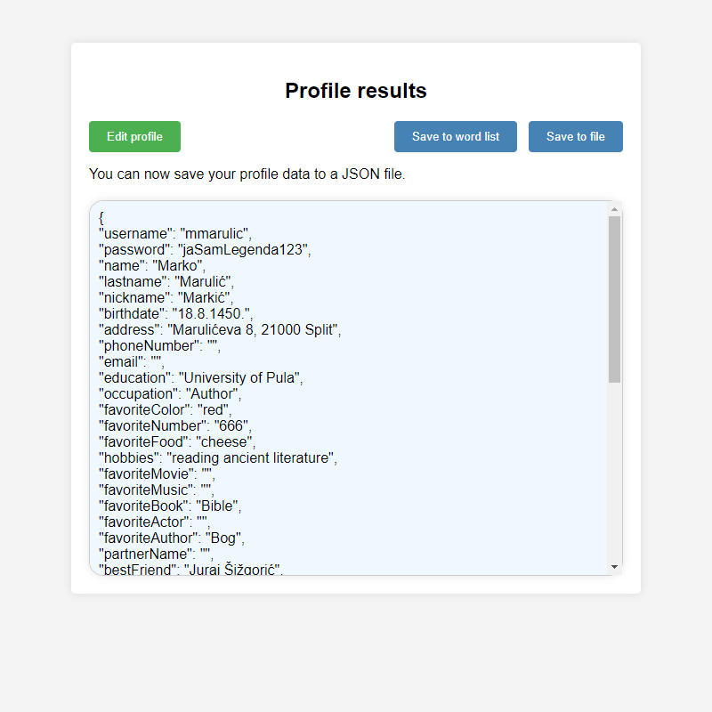

# Basic OSINT system
This is a simplistic Open-Source Intelligence gathering system developed as an example of OSINT operations for the Internet Security (hrv. Sigurnost interneta) course of Information and Software Engineering at the Faculty of Organization and Informatics.

## Disclaimer
It is not meant to be an actual tool used for any nefarious purpose whatsoever.
This is a very simple demo and a such is a 'dirty' solution; code organization and cleanliness were not taken into account and the CSS+JS are combined into the same HTML document to make it simple to run the code.

## Features
* Profile form
  * data is saved in and automatically loaded from cache (`localStorage`)
* Data import/export (`json` file format)
* Wordlist generation (`txt` file format, each word is on a new line, commas are excluded)

## Code
Each fieldset is automatically hidden on startup, and only the current page's fieldset is revealed so as to not overwhelm the user.
Import/export works based on the key-value pairs of the form's input fields.
The wordlist is generated by using spaces as an additional separator for the array of words. It generates all possible combinations of those words (including before and after variants).

## Demo
Provided below are screenshots of the system in use. You can import the exaxmple data (a profile on the father of Croatian literature, Marko Marulić) to try it out for yourself.

